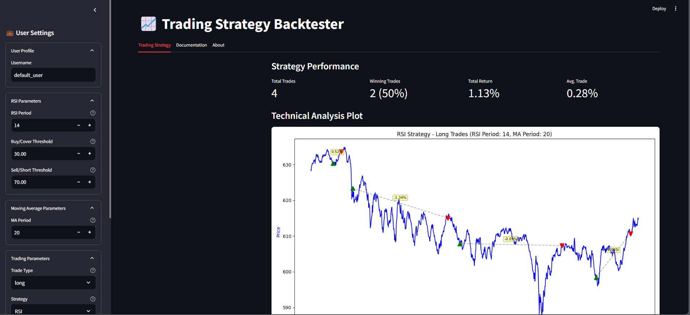
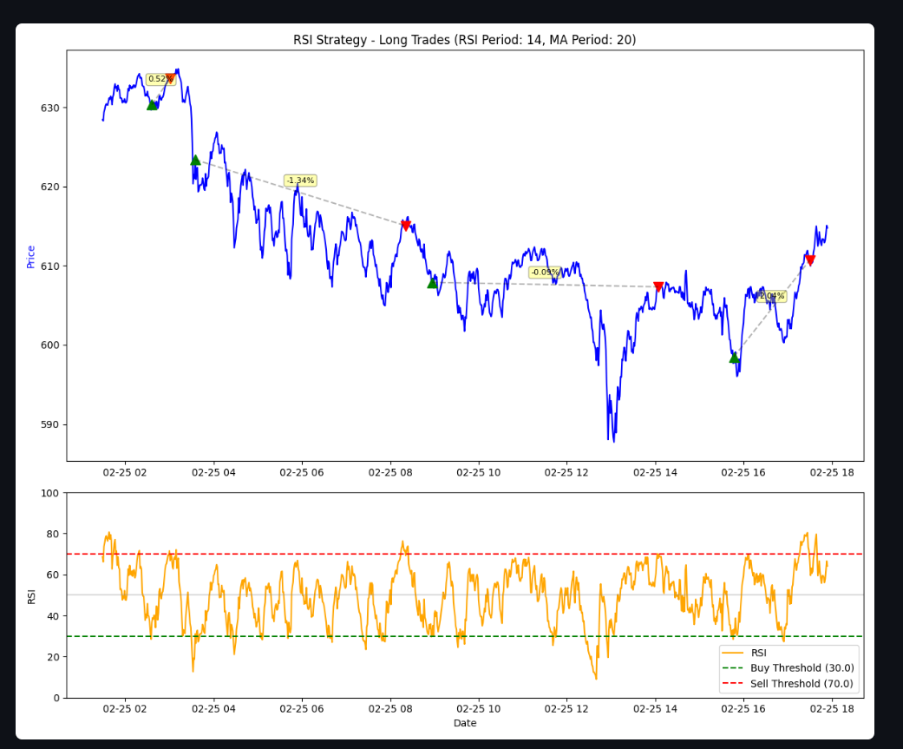
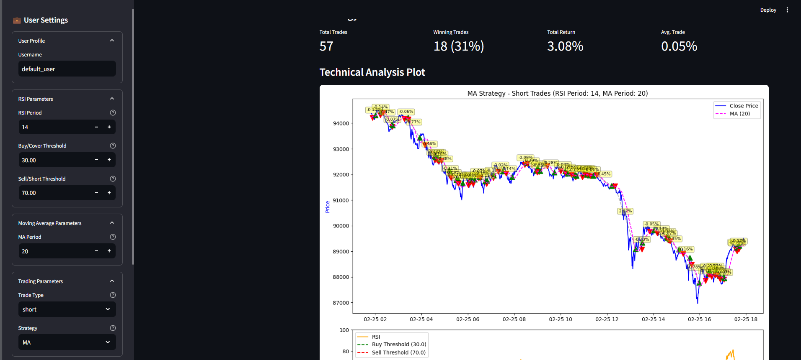
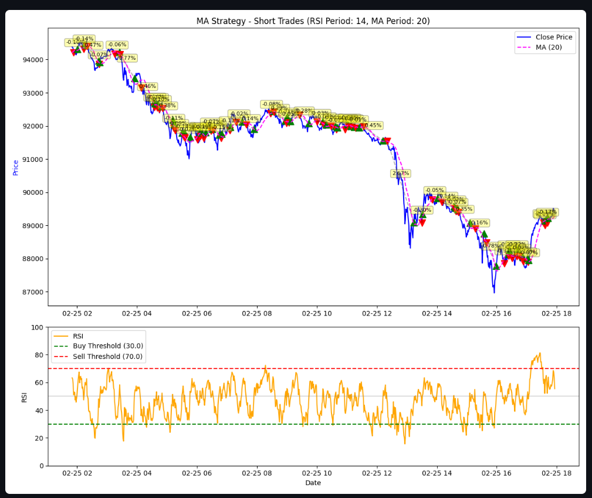
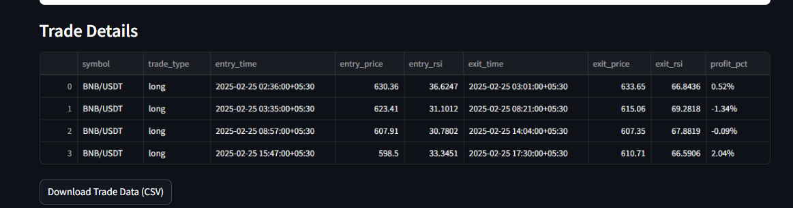
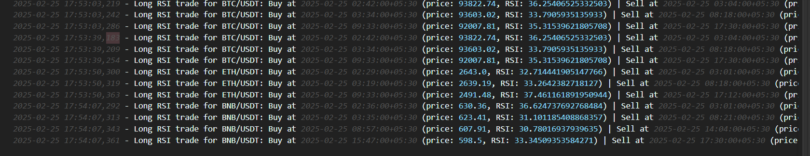

# 📈 Trading Strategy Backtester

A **Streamlit-based Trading Strategy Backtester** using **RSI (Relative Strength Index)** and **Moving Averages (MA)** to simulate and analyze trades on Binance.

## 🚀 Features
- Fetches real-time **OHLCV data** from Binance
- Implements **RSI and Moving Average-based strategies**
- **Visualizes trade entries & exits** with Matplotlib
- **Logs trades** for later analysis
- **Interactive parameters** to tweak strategy settings

---

## 📌 Strategy Overview
### 1️⃣ RSI-Based Strategy
The **RSI strategy** takes trades based on RSI values:
- **Buy** when RSI crosses above the lower threshold (e.g., 30)
- **Sell** when RSI crosses below the upper threshold (e.g., 70)



#### 📊 RSI Graph Example


---

### 2️⃣ Moving Average (MA) Strategy
The **MA strategy** takes trades based on price and moving averages:
- **Buy** when price crosses above the MA
- **Sell** when price crosses below the MA



#### 📈 MA Graph Example


---

## 📜 Trade Details Feature
This feature logs all trade entries and exits for analysis.



## 📁 Logs
Trade details and executions are logged for further review.



---

## 🔧 Installation & Setup

Follow these steps to install and run the Trading Strategy Backtester:

### 1️⃣ Clone the Repository
```sh
git clone https://github.com/Kevalshah91/tusta_task.git
cd trading-backtester
```

### 2️⃣ Create and Activate a Virtual Environment
#### Windows:
```sh
python -m venv venv
venv\Scripts\activate
```
#### macOS/Linux:
```sh
python3 -m venv venv
source venv/bin/activate
```

### 3️⃣ Install Dependencies
```sh
pip install -r requirements.txt
```

### 4️⃣ Run the Streamlit App
```sh
streamlit run final.py
```

Now, open the displayed URL in your browser to interact with the backtester!

---

## 🛠️ Requirements
Ensure you have **Python 3.8+** installed before running the setup.

Enjoy trading! 🚀📊

## 🚀 Contact 

<a href="mailto:kevalshah091@gmail.com">your.email@example.com</a>
